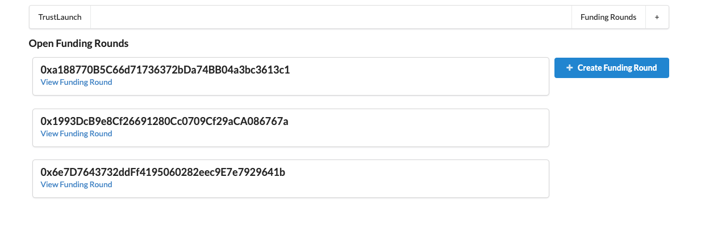

<h1> TrustLaunch </h1>

Solution to prevent scams from happening when investing in very early stage startups. Several times, especially in kickstarter, startups take investors money and transfer it from their bank to spend on whatever they please. Many of these expenses are not related to continuing the growth of the company, and lead to the startup never producing what they were originally supposed to. This allows for every movement of funds that the investors have given, to be tracked and approved by the investors. 

Startups can easily create a funding round and call upon early investors. 

Investors can see statistics of the startup/funding round and contribute if they would like

For a startup to move any of the funds of an investor, they must first create a request that displays the reason for using the funds, an address of the company, and the amount of Ether needed

Then if a majority of investors approve this movement of funds request, the funds are sent over to the address.

